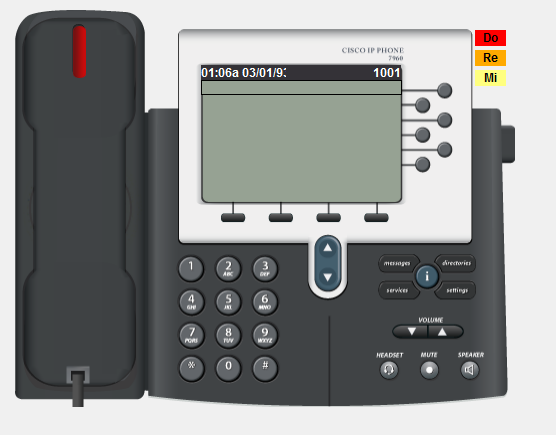
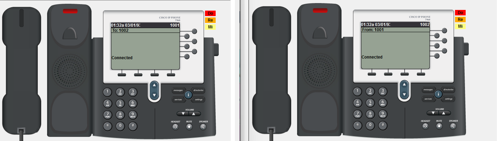
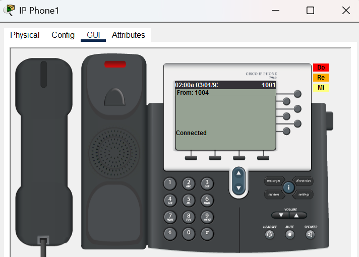
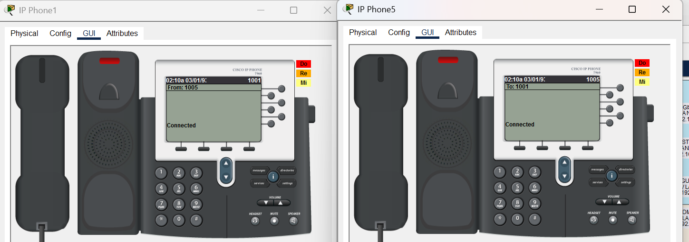
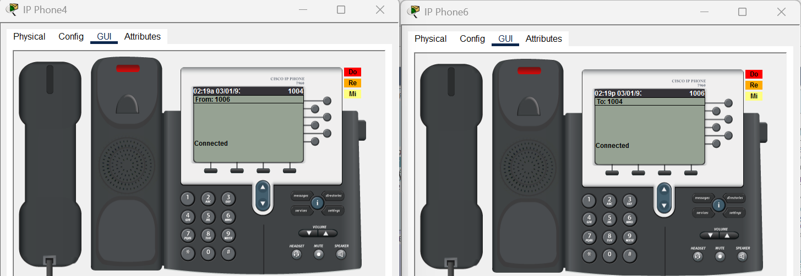
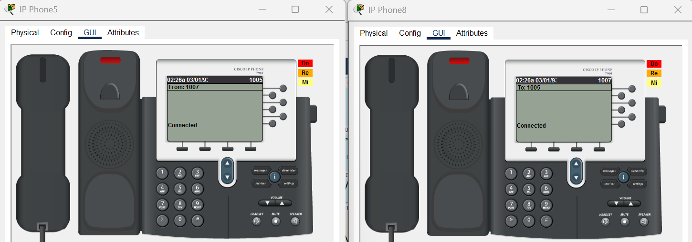
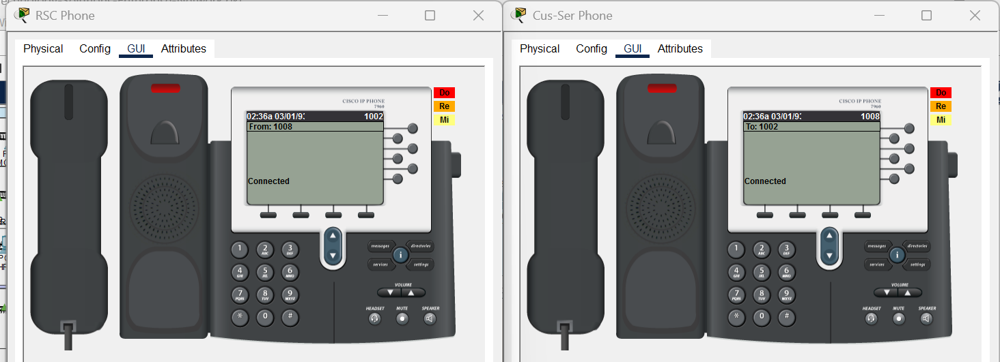
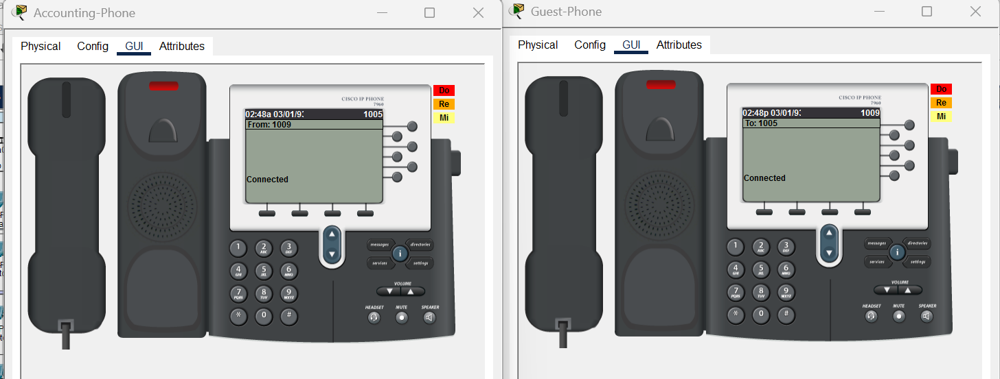
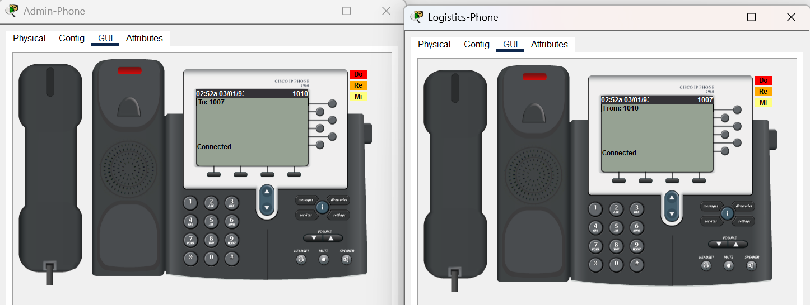
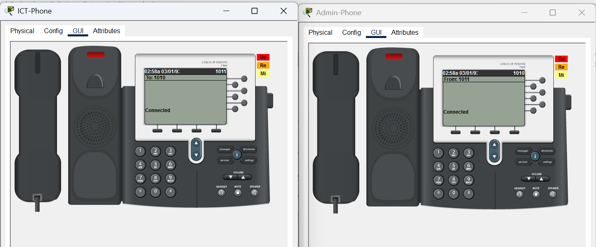

# Royal Technology Solutions — Enterprise Network Infrastructure

**Engineer:** LaVon Thomas  
**Project:** Royal Technology Solutions Infrastructure & Cloud Engineering Lab

## Project Overview

Royal Technology Solutions is a portfolio-scale enterprise infrastructure lab designed to model the networking, systems, security, database, and cloud technologies required to operate a managed IT services and cybersecurity organization.

The enterprise network was designed and implemented in Cisco Packet Tracer using a redundant multilayer architecture. The environment provides segmented departmental networks, dynamic routing, gateway redundancy, centralized network services, secure web and email services, and enterprise VoIP.

The completed network serves as the on-premises infrastructure foundation for the larger Royal Technology Solutions environment, including RoyalDB, Windows Server infrastructure, cybersecurity services, and hybrid-cloud integration with Amazon Web Services (AWS).

### Core Technologies

- Cisco multilayer switching and routing
- IEEE 802.1Q VLAN trunking
- Departmental network segmentation
- Hot Standby Router Protocol (HSRP)
- Open Shortest Path First (OSPF)
- DHCP and DHCP relay
- Domain Name System (DNS)
- HTTPS web services
- SMTP/POP3 email services
- Cisco Unified Communications Manager Express (CME)
- Dedicated voice VLANs
- Cisco IP telephony
- Switch port security
- Redundant Layer 3 paths
- Centralized server infrastructure

## Enterprise Network Architecture

The Royal Technology Solutions enterprise network uses a redundant hierarchical design that separates departmental access networks from Layer 3 routing and core connectivity.

The architecture consists of four multilayer switches and four core routers. Departmental access switches connect end-user devices, including workstations and Cisco IP phones, to dedicated data and voice VLANs.

### Architecture Components

- **4 Multilayer Distribution Switches**
  - F1-L3-SW
  - F2-L3-SW
  - F3-L3-SW
  - F4-L3-SW

- **4 Core Routers**
  - Core-L3-R1
  - Core-L3-R2
  - Core-L3-R3
  - Core-L3-R4

- **11 Departmental Data VLANs**
  - VLANs 10 through 110

- **11 Dedicated Voice VLANs**
  - VLANs 130 through 230

- **1 Centralized Server VLAN**
  - VLAN 120

- **Dynamic Routing**
  - OSPF Process 10
  - Area 0

- **Default-Gateway Redundancy**
  - HSRP on departmental, server, and voice networks

- **Centralized Network Services**
  - DHCP
  - DNS
  - HTTPS
  - SMTP/POP3 email
  - Cisco CME/TFTP

### Redundancy Design

F1-L3-SW and F2-L3-SW provide redundant Layer 3 gateway services for VLANs 10-60 and Voice VLANs 130-180.

F3-L3-SW and F4-L3-SW provide redundant Layer 3 gateway services for VLANs 70-120 and Voice VLANs 190-230.

HSRP virtual IP addresses provide consistent default gateways while OSPF provides dynamic Layer 3 routing across the redundant core infrastructure.

This design allows the lab to demonstrate enterprise concepts including network segmentation, first-hop redundancy, dynamic routing, centralized services, IP telephony, and resilient infrastructure design.

## VLAN and IP Addressing Plan

| VLAN | Department / Purpose | Subnet | HSRP Virtual Gateway |
|---:|---|---|---|
| 10 | Management | 192.168.10.0/26 | 192.168.10.1 |
| 20 | Research | 192.168.10.64/26 | 192.168.10.65 |
| 30 | HR | 192.168.10.128/26 | 192.168.10.129 |
| 40 | Marketing | 192.168.10.192/26 | 192.168.10.193 |
| 50 | Accounts | 192.168.11.0/26 | 192.168.11.1 |
| 60 | Finance | 192.168.11.64/26 | 192.168.11.65 |
| 70 | Logistics | 192.168.11.128/26 | 192.168.11.129 |
| 80 | Customer | 192.168.11.192/26 | 192.168.11.193 |
| 90 | Guest | 192.168.12.0/26 | 192.168.12.1 |
| 100 | Admin | 192.168.12.64/26 | 192.168.12.65 |
| 110 | ICT | 192.168.12.128/26 | 192.168.12.129 |
| 120 | Server Room | 192.168.12.192/26 | 192.168.12.193 |
| 130 | Voice - VLAN 10 | 192.168.13.0/26 | 192.168.13.1 |
| 140 | Voice - VLAN 20 | 192.168.13.64/26 | 192.168.13.65 |
| 150 | Voice - VLAN 30 | 192.168.13.128/26 | 192.168.13.129 |
| 160 | Voice - VLAN 40 | 192.168.13.192/26 | 192.168.13.193 |
| 170 | Voice - VLAN 50 | 192.168.14.0/26 | 192.168.14.1 |
| 180 | Voice - VLAN 60 | 192.168.14.64/26 | 192.168.14.65 |
| 190 | Voice - VLAN 70 | 192.168.14.128/26 | 192.168.14.129 |
| 200 | Voice - VLAN 80 | 192.168.14.192/26 | 192.168.14.193 |
| 210 | Voice - VLAN 90 | 192.168.15.0/26 | 192.168.15.1 |
| 220 | Voice - VLAN 100 | 192.168.15.64/26 | 192.168.15.65 |
| 230 | Voice - VLAN 110 | 192.168.15.128/26 | 192.168.15.129 |

## Layer 2 Switching Design

The access layer provides departmental connectivity for workstations, IP phones, and other endpoint devices. Each department uses a dedicated access VLAN, while IP phones use a separate dedicated voice VLAN.

### Access Port Standard

User endpoint ports follow a standardized configuration pattern. The workstation connects through the Cisco IP phone, allowing a single physical switch port to carry both data and voice traffic.

Example access-port configuration:

```text
interface FastEthernet0/4
 switchport mode access
 switchport access vlan <DATA_VLAN>
 switchport voice vlan <VOICE_VLAN>
 spanning-tree portfast
 switchport port-security
 switchport port-security maximum 3
 switchport port-security mac-address sticky


Get-Content ".\Documentation\Enterprise-Network\Royal-Technology-Solutions-Enterprise-Network.md" -Tail 45

Then verify:

```powershell
Get-Content ".\Documentation\Enterprise-Network\Royal-Technology-Solutions-Enterprise-Network.md" -Tail 45
This configuration provides:

Departmental data VLAN assignment
Dedicated voice VLAN assignment
Faster endpoint convergence using PortFast
Sticky MAC learning
Port-security enforcement
Support for the phone and attached workstation on the same access port
Trunking

The multilayer switches connect to access switches using IEEE 802.1Q trunks. These trunks transport the required departmental data VLANs and voice VLANs between the access and distribution layers.

Spanning Tree

Spanning Tree Protocol protects the Layer 2 topology from switching loops. User-facing access ports use PortFast, while inter-switch links remain under normal spanning-tree control.

During VoIP deployment, access-port validation confirmed both the data and voice VLANs were forwarding correctly before phone registration was considered complete.

## First-Hop Redundancy — HSRP

Hot Standby Router Protocol (HSRP) provides redundant default gateways for the enterprise data, server, and voice VLANs.

### Distribution Pair F1/F2

F1-L3-SW and F2-L3-SW provide gateway redundancy for:

- Data VLANs 10-60
- Voice VLANs 130-180

F1-L3-SW operates as the preferred HSRP Active device with priority 110 and preemption enabled. F2-L3-SW operates as the preferred Standby device with priority 100 and preemption enabled.

### Distribution Pair F3/F4

F3-L3-SW and F4-L3-SW provide gateway redundancy for:

- Data VLANs 70-120
- Voice VLANs 190-230

F3-L3-SW operates as the preferred HSRP Active device with priority 110 and preemption enabled. F4-L3-SW operates as the preferred Standby device with priority 100 and preemption enabled.

### HSRP Design

Each VLAN uses a virtual IP address as the endpoint default gateway. This allows hosts to retain the same gateway address if the active multilayer switch becomes unavailable.

Example:

```text
VLAN 230
Subnet:        192.168.15.128/26
HSRP VIP:      192.168.15.129
F3-L3-SW SVI: 192.168.15.130
F4-L3-SW SVI: 192.168.15.131
Active:        F3-L3-SW
Standby:       F4-L3-SW
Final validation confirmed the redundant HSRP pairs reached the expected Active/Standby states across the implemented VLAN infrastructure.

## Dynamic Routing — OSPF

Open Shortest Path First (OSPF) provides dynamic Layer 3 routing throughout the Royal Technology Solutions enterprise network.

The environment uses **OSPF Process 10** with all infrastructure routing participating in **Area 0**.

### Distribution Layer

The four multilayer switches advertise the departmental data, server, voice, and routed infrastructure networks into OSPF.

- **F1-L3-SW** — Router ID `10.10.10.1`
- **F2-L3-SW** — Router ID `10.10.10.5`
- **F3-L3-SW** — Router ID `10.10.10.41`
- **F4-L3-SW** — Router ID `10.10.10.49`

### Core Routing Layer

Four core routers provide redundant Layer 3 paths between the distribution switches.

- **Core-L3-R1** — Router ID `10.10.10.33`
- **Core-L3-R2** — Router ID `10.10.10.25`
- **Core-L3-R3** — Router ID `10.10.10.50`
- **Core-L3-R4** — Router ID `10.10.10.54`

All core routing relationships operate in OSPF Area 0.

### Routing Redundancy

Each multilayer switch has redundant routed connectivity toward the core infrastructure. OSPF dynamically exchanges routes across these paths and provides alternate Layer 3 paths when available.

The routing environment was validated with established OSPF neighbor adjacencies and dynamically learned routes across the enterprise topology.

OSPF operates together with HSRP to provide two different layers of resiliency:

- **HSRP** provides redundant default gateways for endpoint VLANs.
- **OSPF** provides dynamic routing and redundant Layer 3 paths through the enterprise core.

This combination creates a resilient routed architecture without requiring end-user devices to understand changes occurring within the core network.

## Centralized DHCP and DNS Services

Royal Technology Solutions uses centralized DHCP and DNS services located within the Server Room network on VLAN 120.

### DNS and DHCP Server

- **Server IP:** `192.168.12.196`
- **Subnet:** `192.168.12.192/26`
- **Default Gateway:** `192.168.12.193`
- **Gateway Type:** HSRP virtual IP

### DHCP Architecture

Departmental data and voice networks use centralized DHCP rather than maintaining separate DHCP servers within each VLAN.

Because DHCP discovery traffic is broadcast-based and does not normally cross Layer 3 boundaries, the multilayer switch SVIs use DHCP relay to forward client requests to:

`192.168.12.196`

This design allows DHCP services to remain centralized while supporting clients across the segmented enterprise network.

### Voice DHCP Services

Dedicated DHCP scopes were implemented for Voice VLANs 130-230.

Each voice scope supplies the Cisco IP phones with:

- IP address
- Subnet mask
- HSRP virtual default gateway
- DNS server address
- TFTP/CME server address

The Cisco CME/TFTP service is available at:

`192.168.12.202`

Providing the TFTP address through DHCP allows IP phones to locate the call-processing infrastructure required for configuration and registration.

### DNS Services

The centralized DNS service provides name resolution for enterprise clients.

DNS validation included successful resolution of:

`www.gtech.com`

to the Royal Technology Solutions HTTPS server:

`192.168.12.198`

End-to-end testing confirmed clients in routed VLANs could reach the centralized DNS/DHCP infrastructure and successfully resolve enterprise service names.

## HTTPS Web Services

Royal Technology Solutions hosts an internal enterprise web service within the centralized Server Room network.

### HTTPS Server

- **Server IP:** `192.168.12.198`
- **Subnet:** `192.168.12.192/26`
- **Default Gateway:** `192.168.12.193`
- **DNS Server:** `192.168.12.196`
- **DNS Name:** `www.gtech.com`
- **Services:** HTTP and HTTPS

### Web Service Validation

Enterprise clients were tested across routed departmental VLANs to verify access to the centralized web infrastructure.

Validation included:

- IP connectivity to the server network
- DNS resolution of `www.gtech.com`
- Resolution of `www.gtech.com` to `192.168.12.198`
- HTTPS connectivity from enterprise clients
- Successful display of the Royal Technology Solutions website

### Troubleshooting and Resolution

Initial testing showed that DNS resolution and IP connectivity were functioning correctly, but the HTTPS server displayed the default Cisco Packet Tracer web page.

This isolated the problem to the application layer rather than DNS or network routing.

The default `index.html` content was replaced with the Royal Technology Solutions website. Subsequent HTTPS testing successfully displayed the intended enterprise web page.

This troubleshooting process demonstrated validation across multiple layers: network connectivity, DNS resolution, HTTPS service availability, and application content.

## Enterprise Email Services

Royal Technology Solutions provides centralized enterprise email services from the Server Room network.

### Email Server

- **Server IP:** `192.168.12.201`
- **Subnet:** `192.168.12.192/26`
- **Default Gateway:** `192.168.12.193`
- **DNS Server:** `192.168.12.196`
- **Protocols:** SMTP and POP3
- **Email Domain:** `royalty.com`

### Email Service Validation

Multiple enterprise client accounts were configured to test end-to-end email delivery across the routed network.

Validation confirmed:

- Connectivity to the centralized email server
- SMTP message submission
- POP3 message retrieval
- Successful delivery between enterprise users
- Successful Send/Receive operation across the network

A completed validation test showed an enterprise message successfully transmitted and retrieved using the `royalty.com` domain.

### Packet Tracer Compatibility Issue

The original email configuration used the `Royalty.Local` domain to align with the Windows-style internal lab naming convention.

Cisco Packet Tracer rejected the `.local` email addressing format during client configuration.

The email domain was therefore changed to:

`royalty.com`

After the domain change and corresponding client account updates, SMTP and POP3 testing completed successfully.

This issue was specific to the simulated Packet Tracer environment and provided an additional troubleshooting scenario involving application compatibility rather than a failure of the underlying routing or server infrastructure.

## Enterprise VoIP and Cisco CME

Royal Technology Solutions includes an enterprise IP telephony environment integrated with the existing redundant data network.

Cisco IP phones operate on dedicated voice VLANs while workstations remain on their assigned departmental data VLANs. This separates voice and data traffic while allowing both devices to share the same physical access-switch connection.

### Voice Network Architecture

Eleven dedicated voice VLANs were implemented for the eleven user data VLANs:

| Data VLAN | Voice VLAN | Voice Subnet | HSRP Gateway | Extension |
|---:|---:|---|---|---:|
| 10 | 130 | 192.168.13.0/26 | 192.168.13.1 | 1001 |
| 20 | 140 | 192.168.13.64/26 | 192.168.13.65 | 1002 |
| 30 | 150 | 192.168.13.128/26 | 192.168.13.129 | 1003 |
| 40 | 160 | 192.168.13.192/26 | 192.168.13.193 | 1004 |
| 50 | 170 | 192.168.14.0/26 | 192.168.14.1 | 1005 |
| 60 | 180 | 192.168.14.64/26 | 192.168.14.65 | 1006 |
| 70 | 190 | 192.168.14.128/26 | 192.168.14.129 | 1007 |
| 80 | 200 | 192.168.14.192/26 | 192.168.14.193 | 1008 |
| 90 | 210 | 192.168.15.0/26 | 192.168.15.1 | 1009 |
| 100 | 220 | 192.168.15.64/26 | 192.168.15.65 | 1010 |
| 110 | 230 | 192.168.15.128/26 | 192.168.15.129 | 1011 |

VLAN 120 is reserved for centralized server infrastructure and does not contain a user IP phone.

### Cisco Unified Communications Manager Express

Cisco Unified Communications Manager Express (CME) provides call-processing services for the enterprise VoIP environment.

The CME/TFTP service is available at:

`192.168.12.202`

The environment supports eleven registered IP phones with extensions:

`1001` through `1011`

### VoIP Integration

Each voice VLAN is integrated with the enterprise infrastructure through:

- Dedicated voice VLAN segmentation
- HSRP redundant voice gateways
- OSPF route advertisement
- Centralized DHCP relay
- Voice-specific DHCP scopes
- TFTP/CME discovery
- Cisco IP phone registration
- Access-port voice VLAN configuration

User access ports support a Cisco IP phone and attached workstation while maintaining separate Layer 2 data and voice networks.

### End-to-End Call Validation

VoIP deployment was validated incrementally as each extension was brought online.

Final testing confirmed successful calls between extensions across different departmental voice VLANs.

The final validation connected:

- **ICT:** Extension `1011`
- **Admin:** Extension `1010`

Both phones displayed a connected call, demonstrating successful DHCP addressing, TFTP/CME discovery, phone registration, inter-VLAN routing, and end-to-end voice communication across the enterprise infrastructure.

## Network Security Controls

The Royal Technology Solutions enterprise network incorporates multiple infrastructure security controls designed to reduce unauthorized access, limit Layer 2 exposure, and separate enterprise services.

### Network Segmentation

Departmental systems are separated using dedicated VLANs and IP subnets.

Additional segmentation separates:

- User data traffic
- Voice traffic
- Guest systems
- Administrative systems
- ICT systems
- Centralized server infrastructure

This architecture reduces the size of individual broadcast domains and establishes logical security boundaries between enterprise functions.

### Switch Port Security

User-facing access ports implement Cisco switch port-security controls.

The standardized endpoint configuration includes:

- Port security enabled
- Sticky MAC address learning
- Maximum MAC address limits
- Shutdown violation mode
- Separate data and voice VLAN assignments

Ports supporting an IP phone and attached workstation were configured to accommodate the required endpoint MAC addresses while maintaining port-security enforcement.

### Infrastructure Resiliency

Security and availability are also supported through:

- HSRP redundant default gateways
- OSPF dynamic routing
- Redundant Layer 3 paths
- Centralized DHCP and DNS
- Dedicated Server Room VLAN
- Dedicated voice VLANs
- HTTPS-enabled web services

### ACL Implementation Status

Extended access-control list definitions were created during development of the enterprise network.

However, final validation showed that the ACLs were not bound to the production VLAN interfaces in the completed Packet Tracer topology.

Because an ACL definition alone does not enforce traffic policy, the current documented implementation does not claim active inter-VLAN ACL enforcement.

Guest-network ACL binding was also affected by Cisco Packet Tracer simulation limitations encountered during development.

This distinction is intentionally documented so that the portfolio accurately represents controls that were fully implemented and validated separately from controls designed or tested but not placed into final enforcement.


## Enterprise Testing and Validation

The Royal Technology Solutions network was validated incrementally throughout implementation. Testing was performed at the Layer 2, Layer 3, network-service, application, and VoIP layers.

### Layer 2 Validation

Switching validation included:

- Access VLAN assignments
- Voice VLAN assignments
- IEEE 802.1Q trunk operation
- Spanning-tree forwarding state
- PortFast operation on endpoint ports
- Port-security status
- Sticky MAC address learning
- Port-security violation counters

### Layer 3 Validation

Routing and gateway validation included:

- SVI operational status
- HSRP Active/Standby state
- HSRP peer connectivity
- OSPF neighbor relationships
- OSPF route advertisement
- Routed core connectivity
- Inter-VLAN communication

### Network Services Validation

Centralized infrastructure services were tested from routed client networks.

Validation confirmed:

- DHCP address assignment
- DHCP relay operation
- Correct subnet masks
- Correct HSRP default gateways
- DNS server assignment
- DNS name resolution
- Connectivity to the Server Room network

### Application Validation

Application-layer testing confirmed:

- DNS resolution of `www.gtech.com`
- HTTPS access to the Royal Technology Solutions website
- SMTP email submission
- POP3 email retrieval
- End-to-end enterprise email delivery

### VoIP Validation

Voice infrastructure testing confirmed:

- Voice VLAN operation
- Voice DHCP address assignment
- TFTP/CME discovery
- Cisco IP phone registration
- Extensions `1001-1011`
- Inter-VLAN voice routing
- Successful calls between departmental extensions

The final VoIP validation established a connected call between ICT extension `1011` and Admin extension `1010`.

### Validation Result

The completed testing demonstrated that the enterprise network could simultaneously support segmented user networks, redundant gateways, dynamic routing, centralized infrastructure services, secure web access, enterprise email, and IP telephony.

The validation process also produced a screenshot evidence set documenting major configuration and operational milestones throughout the project.

## Troubleshooting and Break-Fix Engineering

The enterprise network was built and validated incrementally. Several configuration and simulation issues were identified during deployment and resolved through Layer 2, Layer 3, service, and application-level troubleshooting.

### HSRP and Voice VLAN Convergence

Several newly deployed voice VLANs initially displayed HSRP states such as `Speak`, `Listen`, or `Active/unknown`.

Troubleshooting included:

- Verifying both Layer 3 SVIs
- Creating the required voice VLAN on the access switch
- Validating 802.1Q trunk connectivity
- Testing direct connectivity between HSRP peers
- Confirming OSPF advertisement
- Allowing HSRP to reconverge

After correcting Layer 2 VLAN availability and validating peer connectivity, the affected HSRP groups reached the intended Active/Standby state.

### Access-Port and Voice VLAN Troubleshooting

During VoIP deployment, some endpoint ports required correction before phones could successfully register.

Issues encountered included:

- Missing voice VLAN assignments
- Incorrect data and voice VLAN assignments
- Sticky MAC address conflicts
- Port-security shutdown conditions
- Spanning-tree PVID inconsistencies
- Delayed Packet Tracer phone initialization

Validation commands were used to distinguish physical-interface, spanning-tree, VLAN, port-security, DHCP, and CME registration problems.

### Port-Security Recovery

Increasing the permitted MAC-address count did not automatically recover ports that had already entered a security shutdown condition.

Recovery required correction of the port configuration followed by an administrative shutdown/no-shutdown cycle where necessary.

This demonstrated the difference between correcting a configuration and restoring an interface that had already transitioned into an error condition.

### CME Capacity Expansion

The Cisco CME configuration initially supported ten phones and ten directory numbers.

Deployment of the eleventh enterprise phone required increasing the CME limits to support:

- 11 ephones
- 11 directory numbers

The automatic extension assignment range was then standardized for extensions `1001-1011`.

### HTTPS Troubleshooting

DNS resolution and IP connectivity to the HTTPS server were successful, but the server initially displayed the default Cisco Packet Tracer web page.

This isolated the issue to the application layer.

Replacing the default web content with the Royal Technology Solutions site resolved the problem without unnecessary changes to DNS or routing.

### Email Compatibility Troubleshooting

The original email design used the `Royalty.Local` domain.

Cisco Packet Tracer rejected the `.local` email-address format. The simulated email environment was changed to `royalty.com`, after which SMTP submission and POP3 retrieval completed successfully.

### Packet Tracer Platform Limitations

The project also identified several differences between Packet Tracer's simulated Cisco IOS environment and commands available on production Cisco platforms.

Examples encountered included unsupported or limited command variants for:

- Output filtering
- Interface-specific running-configuration display
- VLAN-specific MAC address-table queries
- CME operational display commands
- Guest ACL binding behavior

Where a preferred command was unavailable, alternative validation methods were used rather than assuming configuration success.

### Engineering Outcome

The troubleshooting process became part of the project itself. Each failure was isolated to the appropriate layer, corrected, and retested before implementation continued.

This produced a network that was not only configured but repeatedly validated through realistic break-fix scenarios.

## Project Evidence and Screenshots

Configuration and validation evidence was captured throughout development of the Royal Technology Solutions enterprise network.

The screenshot collection documents the progression from infrastructure configuration through end-to-end service and VoIP validation.

### Server Room and Enterprise Services

Key Server Room evidence includes:

- **52 — Email Server IP Configuration**
  - Validates centralized email-server addressing within VLAN 120.

- **53 — Email Server Service Configuration**
  - Documents SMTP and POP3 service configuration.

- **54 — HTTPS Server IP Configuration**
  - Validates the HTTPS server at `192.168.12.198`.

- **55 — HTTPS Server Web Service**
  - Documents enabled HTTP and HTTPS services.

- **56 — Server Room Switch VLAN 120**
  - Confirms Server Room VLAN implementation.

- **57 — Server Room Switch Trunk Status**
  - Confirms Layer 2 trunk connectivity for centralized services.

- **58 — Server Room Test PC IP Configuration**
  - Demonstrates successful DHCP configuration within VLAN 120.

- **59 — Server Room PC End-to-End Connectivity**
  - Demonstrates successful communication with the local HSRP gateway, centralized DNS infrastructure, and remote enterprise networks.

- **60 — Server Room PC DNS Resolution**
  - Confirms `www.gtech.com` resolves to `192.168.12.198`.

- **61 — Server Room PC HTTPS Service Validation**
  - Confirms successful access to the Royal Technology Solutions HTTPS website.

- **62 — Email Service Send/Receive Validation**
  - Demonstrates successful SMTP/POP3 enterprise email delivery.

### Enterprise VoIP Evidence

VoIP implementation was documented as phones and extensions were progressively deployed across the enterprise.

### VoIP Validation Screenshots

The following screenshots provide implementation evidence for Cisco CME registration, IP phone provisioning, extension assignment, and successful end-to-end VoIP communication across the Royal Technology Solutions enterprise network.

#### CME Registration and Phone Provisioning


*Cisco CME registration validation.*



*Cisco IP phone successfully registered and operational.*


*Extension 1002 registered with the enterprise VoIP environment.*

#### End-to-End VoIP Call Validation



*Successful end-to-end VoIP call validation.*



*Extension 1004 call validation.*



*Extension 1005 call validation.*



*Extension 1006 call validation.*



*Extension 1007 call validation.*



*Extension 1008 call validation.*



*Extension 1009 call validation.*



*Extension 1010 call validation.*



*Final cross-network call validation involving extension 1011, demonstrating operational voice VLAN, DHCP, CME registration, routing, and end-to-end VoIP connectivity.*

Key evidence includes:

- **63 — VoIP Phone CME Registration**
- **64 — VoIP Phone Registered Idle Screen**
- **65 — VoIP Extension 1002 Registered**
- **66 — VoIP End-to-End Call Validation**
- **68 — VoIP Extension 1004 Call Validation**
- **69 — VoIP Extension 1005 Call Validation**
- **70 — VoIP Extension 1006 Call Validation**
- **71 — VoIP Extension 1007 Call Validation**
- **72 — VoIP Extension 1008 Call Validation**
- **73 — VoIP Extension 1009 Call Validation**
- **74 — VoIP Extension 1010 Call Validation**
- **75 — VoIP Extension 1011 Call Validation**

The final screenshot, **75 — VoIP Extension 1011 Call Validation**, documents a connected call between ICT extension `1011` and Admin extension `1010`.
The final screenshot, **75 — VoIP Extension 1011 Call Validation**, documents a connected call between ICT extension `1011` and Admin extension `1010`.
The final screenshot, **75 — VoIP Extension 1011 Call Validation**, documents a connected call between ICT extension `1011` and Admin extension `1010`.


### Evidence Strategy

The screenshots are intended to demonstrate engineering outcomes rather than simply display configuration screens.

Together, the evidence documents:

- VLAN segmentation
- Layer 2 trunking
- HSRP gateway redundancy
- OSPF routing
- DHCP and DNS services
- Server Room connectivity
- HTTPS application delivery
- SMTP/POP3 email delivery
- Voice VLAN deployment
- CME phone registration
- End-to-end VoIP calling
- Troubleshooting and validation

The numbered evidence set provides a chronological technical record of the enterprise network as it progressed from configuration to a fully integrated and validated infrastructure environment.

## Infrastructure Integration and Hybrid Cloud Roadmap

The Royal Technology Solutions enterprise network represents the on-premises networking foundation of a larger infrastructure engineering environment.

The long-term architecture combines enterprise networking, Windows Server infrastructure, database services, cybersecurity controls, automation, and Amazon Web Services into a progressively developed hybrid-cloud platform.

### Royal Technology Solutions Infrastructure Stack

The broader lab environment includes:

- Cisco enterprise networking
- Windows Server 2025 infrastructure
- Active Directory Domain Services
- DNS and DHCP
- File and application services
- Web services
- Network monitoring and security tooling
- PostgreSQL database infrastructure
- RoyalDB
- Infrastructure automation
- Amazon Web Services

### RoyalDB Integration

RoyalDB is the relational database backend developed for Royal Technology Solutions.

The PostgreSQL environment supports operational data including:

- Customers
- Locations
- Devices
- Contracts
- Tickets
- Technicians
- Technician assignments

The database implementation includes relational integrity controls, role-based access control, least-privilege access, and backup/recovery capabilities.

### AWS Migration

RoyalDB was subsequently used to demonstrate migration of an on-premises PostgreSQL workload into AWS.

The migration architecture incorporated:

- Amazon EC2
- Amazon RDS for PostgreSQL
- Amazon S3
- AWS IAM
- AWS Systems Manager
- Private cloud resources
- PostgreSQL backup and restore tooling

Database validation confirmed the migrated RoyalDB schema and operational records were successfully restored into the AWS RDS environment.

### Hybrid-Cloud Direction

The enterprise network and RoyalDB migration establish the foundation for progressively extending Royal Technology Solutions into a hybrid-cloud architecture.

Future development can integrate additional infrastructure components into AWS while preserving the on-premises environment for architecture testing, systems administration, security engineering, automation, and migration practice.

Rather than rebuilding the environment as a cloud-only project, the lab is designed to demonstrate the evolution of an enterprise from on-premises infrastructure toward hybrid and cloud-hosted services.

This approach provides a platform for continued development across networking, systems engineering, cybersecurity, database administration, cloud engineering, and infrastructure automation.

