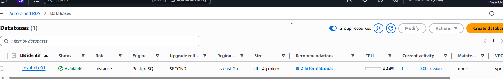
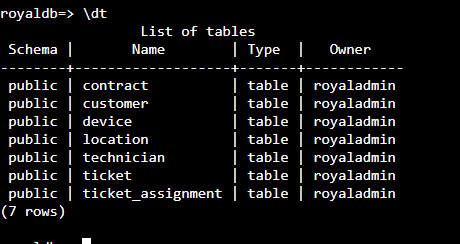
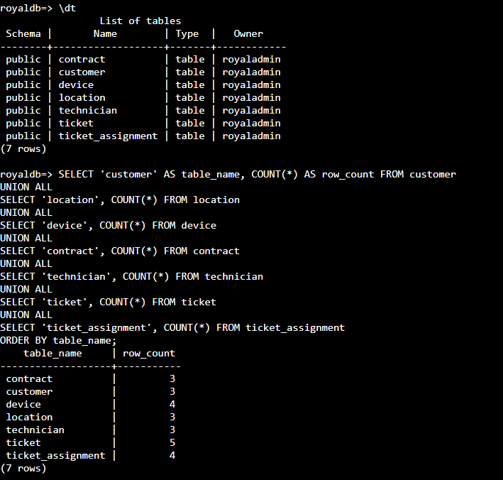
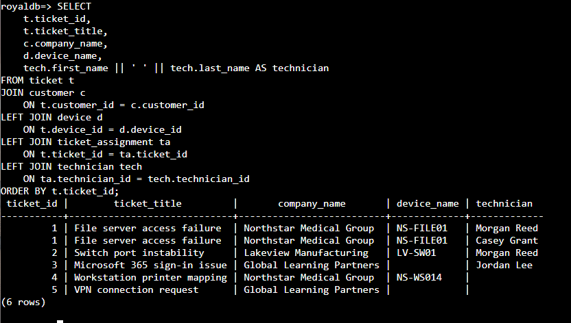
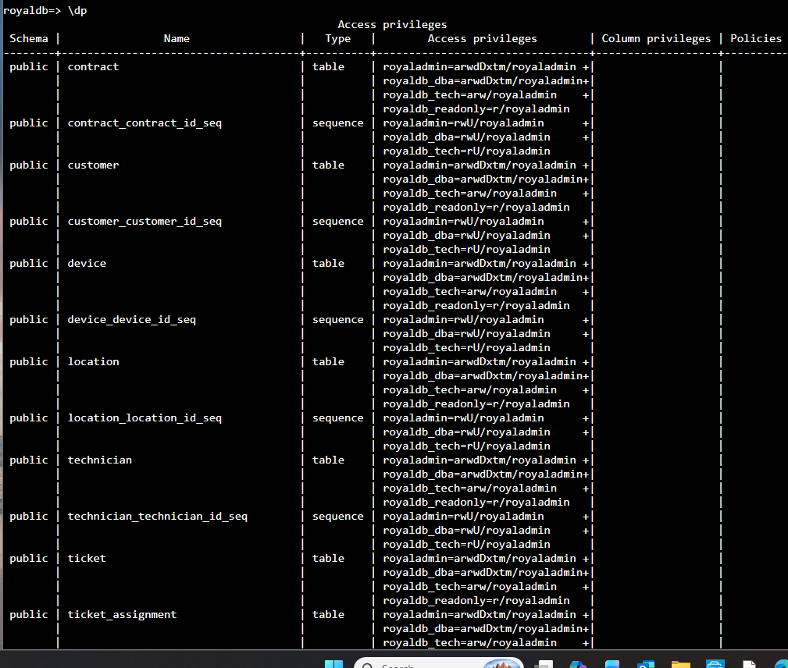
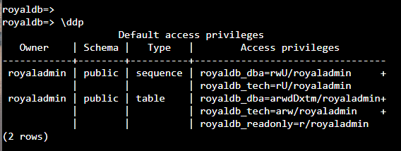

# RoyalDB AWS RDS Migration

## Project Overview

This project documents the migration of the RoyalDB PostgreSQL database from an on-premises/home-lab Windows Server environment to Amazon RDS for PostgreSQL.

The migration was performed as part of the broader Royal Technology Solutions infrastructure build, which includes Windows Server, Active Directory, networking, database services, and AWS cloud integration.

The goal of the migration was to move the operational PostgreSQL database into a private AWS environment while preserving schema structure, relational integrity, data, sequences, and role-based access controls.

## Source Environment

- Platform: Windows Server 2025
- Source server: DB01
- Database platform: PostgreSQL
- PostgreSQL version: 18.6
- Database name: royaldb
- Environment: Royal Technology Solutions home lab
- Source database owner: postgres

## Target Environment

- Platform: Amazon Web Services
- Service: Amazon RDS for PostgreSQL
- Target database: royaldb
- RDS instance: royal-db-01
- Database owner: royaladmin
- Network placement: Private AWS VPC
- Public Internet database access: Disabled
- Database traffic: TCP 5432
- SSL/TLS required for database connectivity

## RoyalDB Data Model

The migrated database contains seven relational tables:

- customer
- location
- device
- contract
- technician
- ticket
- ticket_assignment

The design supports centralized IT service operations for Royal Technology Solutions, including customer management, asset tracking, contracts, technicians, support tickets, and technician assignments.

## Migration Workflow

The migration followed this sequence:

1. Verified PostgreSQL versions on the source and target systems.
2. Identified the production RoyalDB database on DB01.
3. Created a PostgreSQL custom-format backup using pg_dump.
4. Inspected the backup archive with pg_restore.
5. Securely transferred the dump from DB01 to the administrative workstation.
6. Uploaded the database dump to a private Amazon S3 bucket.
7. Granted the AWS EC2 Systems Manager role temporary access to the migration bucket.
8. Downloaded the dump to the AWS EC2 migration host.
9. Connected from the EC2 host to the private RDS PostgreSQL instance.
10. Restored the database using pg_restore with ownership and ACL translation disabled.
11. Recreated application roles and permissions for the AWS environment.
12. Validated tables, data, constraints, relationships, sequences, and permissions.

## Backup Method

A PostgreSQL custom-format archive was created using pg_dump.

Example:

```powershell
& "C:\Program Files\PostgreSQL\18\bin\pg_dump.exe" `
-U postgres `
-d royaldb `
-F c `
-v `
-f "C:\RoyalDB_Backups\royaldb_aws_migration.dump"
```

The custom format was selected because it provides flexible restore capabilities and allows the database structure and data to be inspected before restoration.

## Secure Transfer Path

The migration archive followed this path:

```text
DB01
  |
  v
Administrative Workstation
  |
  v
Private Amazon S3 Bucket
  |
  v
Royal-Web-01 EC2
  |
  v
Amazon RDS PostgreSQL
```

The RDS database remained private throughout the migration. No direct public database access was enabled.

## Restore Strategy

The database was restored using `pg_restore`.

Ownership and ACL information from the original PostgreSQL environment were intentionally not restored directly. The restore used:

```text
--no-owner
--no-acl
```

This allowed the RDS administrative account (`royaladmin`) to own the restored objects while RoyalDB application roles and permissions were recreated specifically for the AWS environment.

This avoided dependencies on the original PostgreSQL `postgres` owner and accommodated the managed privilege model of Amazon RDS.

## Migration Results

All seven RoyalDB tables were successfully restored.

### Row Count Validation

| Table | Source Rows | AWS RDS Rows |
|---|---:|---:|
| customer | 3 | 3 |
| location | 3 | 3 |
| device | 4 | 4 |
| contract | 3 | 3 |
| technician | 3 | 3 |
| ticket | 5 | 5 |
| ticket_assignment | 4 | 4 |

All source and target row counts matched.

**Total validated rows: 25**

## Constraint Validation

The migrated database was validated for relational integrity.

Primary keys confirmed:

- `contract_pkey`
- `customer_pkey`
- `device_pkey`
- `location_pkey`
- `technician_pkey`
- `ticket_pkey`
- `ticket_assignment_pkey`

Foreign keys confirmed:

- `contract_customer_id_fkey`
- `device_location_id_fkey`
- `location_customer_id_fkey`
- `ticket_assignment_technician_id_fkey`
- `ticket_assignment_ticket_id_fkey`
- `ticket_customer_id_fkey`
- `ticket_device_id_fkey`

The technician email uniqueness constraint was also confirmed:

```text
technician_email_key
```

A total of 78 constraints were returned through PostgreSQL's information schema, including primary-key, foreign-key, unique, CHECK, and NOT NULL enforcement entries.

## Relationship Testing

Relational behavior was tested using a multi-table JOIN across:

- `ticket`
- `customer`
- `device`
- `ticket_assignment`
- `technician`

The query successfully associated tickets with their customers, devices, and assigned technicians.

Testing also demonstrated one-to-many behavior: a ticket assigned to two technicians correctly produced two assignment rows.

## Sequence Validation

Post-migration sequence values were compared with the maximum IDs currently stored in each table.

| Table | Maximum ID | Sequence Value |
|---|---:|---:|
| customer | 3 | 3 |
| location | 3 | 3 |
| device | 4 | 4 |
| contract | 3 | 3 |
| technician | 3 | 3 |
| ticket | 5 | 11 |
| ticket_assignment | 4 | 4 |

All sequence values were at or above their corresponding maximum IDs.

The ticket sequence being higher than the current maximum ticket ID is valid because PostgreSQL sequences do not automatically reuse previously consumed values.

## Role-Based Access Control

Three RoyalDB group roles were recreated in Amazon RDS:

```text
royaldb_dba
royaldb_tech
royaldb_readonly
```

The roles were created with `NOLOGIN`, separating permissions from individual login identities.

### royaldb_dba

Granted:

- CONNECT to `royaldb`
- USAGE on the `public` schema
- Full privileges on existing tables
- Full privileges on existing sequences

### royaldb_tech

Granted:

- CONNECT to `royaldb`
- USAGE on the `public` schema
- SELECT, INSERT, and UPDATE on tables
- USAGE and SELECT on sequences

DELETE access was intentionally not granted.

### royaldb_readonly

Granted:

- CONNECT to `royaldb`
- USAGE on the `public` schema
- SELECT on tables

No INSERT, UPDATE, DELETE, or sequence privileges were granted.

## Default Privileges

Default privileges were configured for future objects created by `royaladmin` in the `public` schema.

Future tables automatically grant:

- Full table privileges to `royaldb_dba`
- SELECT, INSERT, UPDATE to `royaldb_tech`
- SELECT to `royaldb_readonly`

Future sequences automatically grant:

- Full sequence privileges to `royaldb_dba`
- USAGE and SELECT to `royaldb_tech`

This preserves the RoyalDB least-privilege model as the database grows.

## Security Controls Demonstrated

- Private Amazon RDS deployment
- No public RDS database exposure
- Security-group-controlled PostgreSQL connectivity
- SSL/TLS database connections
- IAM role-based EC2 permissions
- AWS Systems Manager Session Manager administration
- Private Amazon S3 migration staging
- S3 Block Public Access
- PostgreSQL role-based access control
- Least-privilege database permissions
- Separation of administrative and application roles

## Skills Demonstrated

- PostgreSQL administration
- `pg_dump` and `pg_restore`
- Database migration planning and execution
- Amazon RDS
- Amazon EC2
- Amazon S3
- AWS IAM roles and policies
- AWS Systems Manager
- VPC private networking
- PostgreSQL RBAC
- SQL and relational database validation
- Primary and foreign key validation
- Sequence validation
- Least-privilege security design
- Hybrid-cloud infrastructure integration

## Migration Outcome

The RoyalDB migration from the Royal Technology Solutions home-lab environment to Amazon RDS was completed successfully.

The source and target databases were validated for table structure, row counts, primary keys, foreign keys, unique and CHECK constraints, relational JOIN behavior, sequence state, role-based access control, and default privileges.

The AWS-hosted RoyalDB now provides the cloud database foundation for continued Royal Technology Solutions infrastructure and application development.

## Security Note

Sensitive environment information is intentionally excluded from public documentation.

The public repository should not contain:

- AWS account IDs
- Full RDS endpoints
- Passwords
- AWS access or secret keys
- Session tokens
- Private key files
- Production credentials

## Migration Evidence

The following screenshots document key stages and validation results from the RoyalDB migration.

### Amazon RDS Deployment

The RoyalDB target database is deployed as an Amazon RDS for PostgreSQL instance in the Royal Technology Solutions AWS environment.



### Restored Database Tables

Post-migration validation confirmed all seven RoyalDB relational tables were successfully restored to Amazon RDS.



### Row Count Validation

Row counts were verified after migration to confirm that the source data was successfully transferred.



### Relationship Validation

A multi-table SQL JOIN validated relationships between tickets, customers, devices, technician assignments, and technicians.



### Role-Based Access Control

PostgreSQL access privileges were validated for the DBA, technician, and read-only group roles.



### Default Privileges

Default PostgreSQL privileges were configured so future tables and sequences created by the database administrator inherit the appropriate least-privilege access model.


